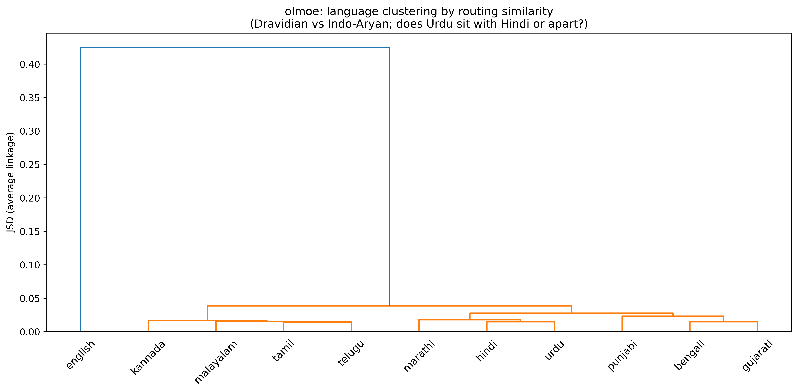

# Indic MoE Expert Specialization

**Do the experts in open Mixture-of-Experts (MoE) language models spontaneously
specialize by Indic language family or script — and is that specialization
causal or incidental?**

This repository analyzes the router behavior of three open MoE models on
parallel Indic text, with no training involved. It tests, on 11 Indian
languages across two families and many scripts, whether the routing behavior
[Mixtral](https://arxiv.org/abs/2401.04088) reported holds when the languages
are Indic — a setting no prior expert-specialization study covered.

**What Mixtral actually found** (Jiang et al. 2024, §5 "Routing analysis"): the
router shows *no* topic/domain specialization — "*we do not observe obvious
patterns in the assignment of experts based on the topic*" (expert distribution
is near-identical across ArXiv, PubMed, and PhilPapers text, their Figure 7) —
but *does* show "*structured syntactic behavior*", routing by token-level and
positional features (e.g. `self` in Python and `Question` in English go to the
same expert; consecutive tokens and indentation cluster; their Figure 8 /
Table 5). Their evidence is entirely English + code. **Whether that
topic-invariant, syntax-driven picture survives when the "domain" is instead a
different *language* or *script* is exactly what no one had checked — and what
this study measures.** Note that in our setting "does routing separate
languages/families?" is a sharper question than Mixtral's topic test: language
and script are much stronger surface/structural signals than document topic, so
finding language-family structure does not by itself contradict Mixtral — the
informative results are the *script-vs-language* control (Hindi–Urdu) and the
per-architecture differences, below.

<p align="center">
  <br>
  <em>Unsupervised clustering of languages by routing similarity (OLMoE).
  English splits off first; the router then recovers the Dravidian vs
  Indo-Aryan family split on its own — and places Hindi and Urdu as sisters
  despite their completely different scripts.</em>
</p>

## Key findings

Measured across **OLMoE-1B-7B** (64 experts, no shared, English-heavy training),
**Qwen1.5-MoE-A2.7B** (60 routed + 1 shared, multilingual), and
**deepseek-moe-16b-base** (64 routed + 2 shared, multilingual):

1. **Routing is family-structured in all three models.** Within-family routing
   divergence (JSD) is lower than cross-family in every model (ratios
   0.56–0.84), with 100% of language pairs significant under a sentence-level
   permutation test. The Dravidian/Indo-Aryan split emerges with zero
   supervision.

2. **The Hindi–Urdu control splits by architecture.** Hindi and Urdu are
   nearly the same spoken language written in different scripts (Devanagari vs
   Perso-Arabic), so they cleanly separate *language identity* from *script*.
   The English-heavy **OLMoE** routes them together (Hindi–Urdu JSD *below*
   Hindi's mean to its other Indo-Aryan relatives, ratio 0.56 — language
   identity wins); the multilingual **Qwen** routes them apart (ratio 1.58 —
   script wins); **DeepSeek** sits in between (ratio 0.93, roughly tied). So on
   this control the three models disagree, and the ordering runs *opposite* to
   the naive expectation: the model with the least multilingual training shows
   the strongest language-identity (script-invariant) routing. Reading this
   through Mixtral's lens — where routing tracked token-level/structural
   features (of which script is one) rather than higher-level meaning — Qwen's
   script-driven routing is consistent with it, DeepSeek is ambiguous, and
   OLMoE (routing by language identity *across* scripts) runs contrary to it —
   i.e. the pattern is
   architecture-dependent, not universal, on Indic text.

3. **Specialization broadly increases with layer depth**, with a distinct
   signature per architecture. In OLMoE the Dravidian/Indo-Aryan ordering is
   consistent at every layer (Dravidian diverges more from English throughout)
   and overall divergence rises toward the final layers; Qwen is noisier with a
   sharp late-layer jump; DeepSeek shows the reversed family ordering.

4. **Ablation gives causal backing.** Two specificity tests, both supportive:
   ablating a family's most-preferred experts hurts that family's languages
   more than ablating the same number of *random* experts in 5 of 6 Indic cases
   (the exception is DeepSeek's Dravidian experts, whose random baseline is
   unusually high); and on the stronger cross-family test — does ablating family
   F hurt F more than the *other* family? — the differential is positive in
   **all 6 cases**. Together this is evidence that these experts causally carry
   these languages, not merely correlate with them.

### The numbers

**Family-structured routing** (mean JSD across layers; lower within-family than
cross-family means the router separates the two Indic families):

| Model | within-family JSD | cross-family JSD | ratio | median effect size |
|---|---|---|---|---|
| OLMoE | 0.0217 | 0.0386 | **0.56** | 90 SD |
| Qwen1.5-MoE | 0.0451 | 0.0540 | 0.84 | 113 SD |
| deepseek-moe-16b | 0.0429 | 0.0511 | 0.84 | 73 SD |

Effect sizes are standard deviations above the **sentence-level** permutation
null (the honest unit; token-level nulls overstate significance). All 55
language pairs are significant at p<0.05 in every model.

**The Hindi–Urdu control** (same spoken language, different script — isolates
language identity from orthography):

| Model | Hindi–Urdu JSD | Hindi vs other Indo-Aryan (mean) | ratio | verdict |
|---|---|---|---|---|
| OLMoE | 0.0148 | 0.0262 | **0.56** | language identity > script |
| Qwen1.5-MoE | 0.0484 | 0.0306 | 1.58 | script dominates |
| deepseek-moe-16b | 0.0367 | 0.0394 | 0.93 | roughly tied |

A ratio below 1 means Urdu routes *closer* to Hindi than Hindi's own family
relatives do — i.e. routing follows language, not script. The English-heavy
OLMoE shows this most strongly; the multilingual Qwen shows the opposite.

Full numbers are in [`results/figures/findings_summary.txt`](results/figures/findings_summary.txt);
all figures are in [`results/figures/`](results/figures/).

## Method in brief

- **Data.** FLORES-200 devtest (parallel across all languages), sampled to an
  **equal token budget per language** (not equal sentence count). Indic scripts
  fragment into many more subword tokens per unit of meaning than Latin script,
  so equal-sentence sampling would hand high-fertility languages more routing
  decisions and inflate their apparent divergence. Equal tokens gives every
  language equally-precise routing distributions and closes that confound.

- **Tokenization sanity check.** Before trusting any routing result, we
  verified every model's tokenizer actually encodes each of the 11 languages
  into real subwords rather than collapsing whole scripts to `<unk>` (which
  would make "routing" reflect the model choking on unknown tokens, not
  genuine processing). Result: **0.0000% `<unk>` tokens, all 11 languages,
  all 3 models** — reproducible via `scripts/verify_tokenization.py`, full
  log in [`results/figures/tokenization_audit.txt`](results/figures/tokenization_audit.txt).

- **Routing extraction.** PyTorch forward hooks on each layer's router capture,
  per token, the full softmax over **routed** experts and the top-k selection.
  Shared experts (Qwen, DeepSeek) fire on every token and carry no
  specialization signal, so they are excluded. Routers are kept in full
  precision even under 4-bit quantization, since the router logits are the
  measured quantity.

- **Statistics.** Pairwise Jensen-Shannon divergence between languages' expert-
  usage distributions, computed **per layer**. Significance via a permutation
  test that shuffles **sentence** labels (the independent unit) rather than
  tokens (which are within-sentence correlated and yield an anticonservative
  null). Sentence-level bootstrap confidence intervals throughout.

- **Causal test.** For each language family, identify its most
  disproportionately-used experts, ablate them, and measure the loss increase —
  compared against a baseline of ablating the same number of *random* experts.

Every architecture-specific detail lives in `src/adapters/`; the analysis code
(`src/routing.py`, `src/ablation.py`) is model-agnostic. Adding a fourth model
is one adapter plus three config lines.

## Repository layout

```
config.yaml                  Single source of truth: models, languages, seeds, all parameters
run_all.sh                   One-command entrypoint for a GPU pod (checks -> prefetch -> run)
requirements.txt / Dockerfile
src/
  adapters/                  The only architecture-specific code
    base.py                  Interface every adapter implements
    olmoe.py qwen_moe.py deepseek_moe.py
  data.py                    FLORES-200 download + token-capped sampling
  routing.py                 JSD, per-layer permutation tests, bootstrap CIs
  ablation.py                Targeted + random-control expert ablation
  pipeline.py                End-to-end orchestration with per-stage checkpointing
  manifest.py                Run provenance (git commit, config hash, GPU, seeds)
scripts/
  run_model.py               Run one model
  run_all_models.py          Run all three, continue past a per-model failure
  prefetch_model.py          Robust model-weight download (parallel, resumable)
  analyze_results.py         results/ -> figures + findings summary (no GPU needed)
tests/
  test_routing.py            Unit tests for the statistical core
results/                     Published outputs (figures + per-layer JSD, permutation,
                             bootstrap, ablation, and run manifests). Raw per-token
                             routing pickles are regenerable and not committed.
```

## Reproducing

Runs on a single 24–48 GB GPU; all three models load in 4-bit sequentially.

```bash
git clone https://github.com/regiusherder/indic-moe-specialization.git
cd indic-moe-specialization
bash run_all.sh                       # checks env, prefetches weights, runs all 3 models
python scripts/analyze_results.py --results ./results --out ./results/figures
```

`run_all.sh` is self-contained: it verifies GPU/disk, pins the model cache to
local disk, prefetches all model weights with a parallel resumable downloader,
then runs the pipeline offline. Every model's run writes a `manifest.json`
recording the git commit, config hash, model revision (SHA-pinned), GPU, and
FLORES checksum, so any result traces back to exactly what produced it.

Run just the analysis on the committed results without a GPU:

```bash
pip install -r requirements.txt
python scripts/analyze_results.py --results ./results --out /tmp/figs
```

Unit tests for the statistics (CPU-only):

```bash
python tests/test_routing.py
```

## Models analyzed

| Model | Architecture | Routed / shared experts | top-k | Indic exposure |
|---|---|---|---|---|
| `allenai/OLMoE-1B-7B-0125` | standard MoE | 64 / 0 | 8 | minimal (English-heavy) |
| `Qwen/Qwen1.5-MoE-A2.7B` | shared + routed | 60 / 1 | 4 | moderate (multilingual) |
| `deepseek-ai/deepseek-moe-16b-base` | fine-grained shared + routed | 64 / 2 | 6 | moderate (multilingual) |

Languages (FLORES-200): English (control) plus Hindi, Marathi, Bengali,
Gujarati, Punjabi, Urdu (Indo-Aryan) and Tamil, Telugu, Malayalam, Kannada
(Dravidian).

## References

- Jiang et al. (2024), **Mixtral of Experts**, arXiv:2401.04088. §5 "Routing
  analysis" is the source of the routing-behavior claim this study tests:
  no observed topic/domain specialization, but structured syntactic /
  token-level routing (Figures 7–8, Table 5). Quotes above are verbatim from
  that section.
- Muennighoff et al. (2024), **OLMoE: Open Mixture-of-Experts Language Models**,
  arXiv:2409.02060.
- Team, **Qwen1.5-MoE**, https://huggingface.co/Qwen/Qwen1.5-MoE-A2.7B.
- Dai et al. (2024), **DeepSeekMoE**, arXiv:2401.06066 (architecture of
  `deepseek-moe-16b-base`).
- NLLB Team (2022), **FLORES-200** evaluation benchmark, arXiv:2207.04672.

## License

Code released under the MIT License. Model weights and the FLORES-200 dataset
are governed by their respective upstream licenses.
